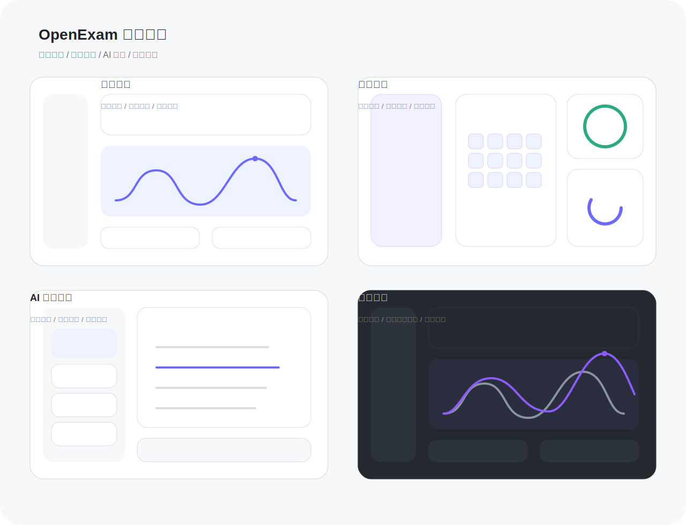

<p align="center">
  
</p>

<h1 align="center">OpenExam</h1>

<p align="center">
  本地优先的 AI 备考与训练桌面应用
</p>

<p align="center">
  
  
  
  
  
</p>

<p align="center">
  智能出卷 · AI 辅导 · 自定义练习 · 成长体系 · 本地持久化
</p>

## 产品概览

OpenExam 是一个基于 `Electron + React + SQLite` 的桌面端学习平台，面向考公、考证、刷题训练与 AI 辅导场景，提供从题库导入、智能组卷、答题分析到成长追踪的一体化学习链路。

## 界面预览

<p align="center">
  
</p>

<p align="center">
  <sub>学习中心 · 我的成长 · AI 智能导师 · 深色模式</sub>
</p>

## 核心能力

- `AI 出卷`：根据知识点、难度、题型快速生成试卷与练习。
- `AI 导师`：支持讲题、追问、知识点梳理、举一反三。
- `自定义试卷`：用户可保存自定义试卷与自定义练习，并持久化到本地。
- `题库导入`：支持图片 OCR、PDF、Excel、CSV、JSON 等多种来源。
- `错题闭环`：记录答题结果、错因与练习历史，形成复习闭环。
- `成长体系`：等级、成就、学习日历、阶段目标统一沉淀。
- `本地优先`：学习数据默认保存在本地，更适合个人长期积累。

## 技术栈

| 层级 | 方案 |
| --- | --- |
| 桌面容器 | Electron |
| 前端界面 | React + Vite |
| 本地数据库 | SQLite + better-sqlite3 |
| 状态与数据 | 本地 Store + Renderer 页面状态 |
| AI 模型 | OpenAI / Claude / DeepSeek / 豆包 / Kimi / 通义千问 / 智谱 GLM |

## 快速开始

```bash
npm install
npm run dev
```

### 常用命令

```bash
# 构建前端
npm run build

# 重建 Electron 原生依赖
npm run rebuild:electron

# 本地打包 macOS
npm run dist:mac

# 本地打包 Windows
npm run dist:win
```

## Release 流程

项目已接入 GitHub Actions 自动构建与 Release 打包：

- 推送 `v*` 标签后自动触发构建。
- 自动产出 `macOS` 安装包与 `Windows` 安装包。
- 构建产物自动上传到 GitHub Release。
- Release 页面自动附带 macOS 首次打开说明。

```bash
git tag v0.1.1
git push origin v0.1.1
```

## macOS 首次打开说明

当前自动构建的 macOS 包未做 Apple notarization。若系统拦截，可按以下方式处理：

- 在 Finder 中右键 `OpenExam.app`，选择“打开”。
- 若仍被拦截，可执行：

```bash
xattr -dr com.apple.quarantine /Applications/OpenExam.app
```

## 适用场景

- 公务员考试 / 行测刷题
- 教师资格证 / 法考 / 考研
- IT 认证 / 通用知识训练
- 自定义题库与长期练习

## License

MIT
